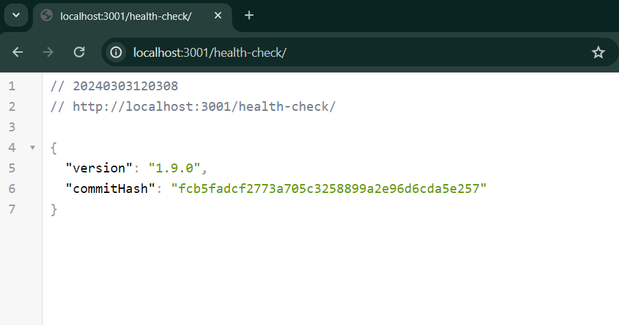

#  Health Check Plus for Express.js

This npm package provides a supercharged out-of-the-box health check middleware for Express.js applications. It simplifies the process of adding a health check endpoint to your backend Node.js projects, especially when deploying on AWS or other platforms.

## Table of Contents

- [Installation](#installation)
- [Usage](#usage)
- [Examples](#examples)
- [API](#api)
- [Health Checks](#health-checks)
- [Code Explanation](#code-explanation)
- [Why Was This Package Created?](#why-was-this-package-created)
- [License](#license)

## Installation

To install the package, use npm:

```bash
npm install --save health-check-plus
```

## Usage

Simply import the `healthCheckPlus` into your Express.js application and use it as a middleware. This middleware provides a comprehensive health check endpoint with version information and the latest commit hash.

## Examples

### ES Module Usage

```javascript
import express from 'express';
import { healthCheckPlus } from 'health-check-plus';

const app = express();

// Add health check middleware
app.use('/health', healthCheckPlus);

// Other routes and middleware can be defined here

// Start the server
const port = process.env.PORT || 3000;
app.listen(port, () => {
  console.log(`Server is running on port ${port}`);
});
```

### CommonJS Usage

```javascript
const express = require('express');
const { healthCheckPlus } = require('health-check-plus');

const app = express();

// Add health check middleware
app.use('/health', healthCheckPlus);

// Other routes and middleware can be defined here

// Start the server
const port = process.env.PORT || 3000;
app.listen(port, () => {
  console.log(`Server is running on port ${port}`);
});
```

### Response in Browser


## API

### healthCheckPlus Middleware Function

Middleware function for performing a supercharged health check operation. It retrieves version information and the latest commit hash and sends it as a JSON response.

- `healthCheckPlus(req: Request, res: Response, next: NextFunction)`: Middleware function for performing a supercharged health check operation.

  - `req`: Express Request object.
  - `res`: Express Response object.
  - `next`: Express NextFunction object.

## Health Checks

To facilitate health checks, this utility automatically updates the `package.json` file with the latest commit hash. This allows health checks to read the latest commit hash from the `package.json` file.

## Code Explanation

- The `GetVersionInfo` function retrieves version information from the `package.json` file and the latest commit hash from the associated Git repository.
- It accepts two optional parameters: `packageJsonPath` (path to the `package.json` file) and `versionInfo` (existing version information).
- The `AppVersionInfo` class represents version information with properties for version and commit hash.
- The utility exports the `AppVersionInfo` class and the `GetVersionInfo` function for external use.

## Why Was This Package Created?

This npm package was created to address the repetitive task of adding a health check endpoint to backend Node.js projects, especially when deploying on AWS or other platforms. The author of this package found it cumbersome to manually create health checks for each project and decided to create a supercharged solution that can be easily integrated into any Express.js application.

## License

This project is licensed under the [MIT License](LICENSE).